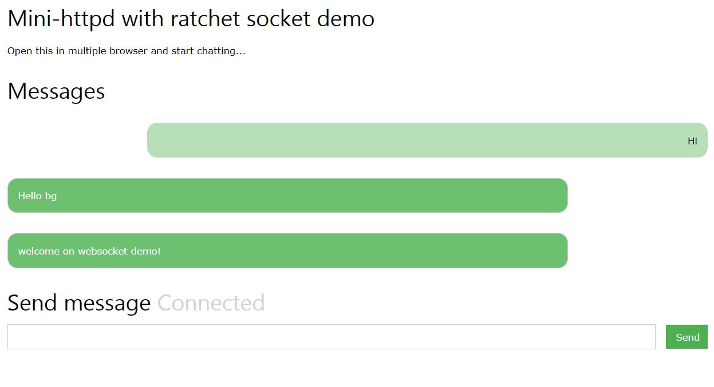

# mini-httpd with ratchet websocket demo
This is an example application that shows integration between [phpbg/mini-httpd](https://github.com/phpbg/mini-httpd) and [Ratchet Websocket](http://socketo.me/). 

# License
MIT

# Install & run
Install with [composer](https://getcomposer.org/): go at the root of the project and run:
```
composer install
```

Run with:
```
php server.php
```

Browse at `http://localhost:8090` and start chatting

